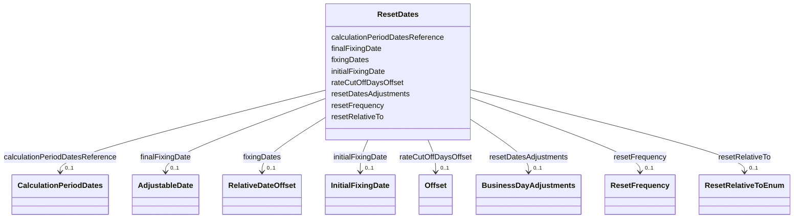

```mermaid
 classDiagram
    class ResetDates
    click ResetDates href "../ResetDates"
      ResetDates : calculationPeriodDatesReference
        
          
    
        
        
        ResetDates --> "0..1" CalculationPeriodDates : calculationPeriodDatesReference
        click CalculationPeriodDates href "../CalculationPeriodDates"
    

        
      ResetDates : finalFixingDate
        
          
    
        
        
        ResetDates --> "0..1" AdjustableDate : finalFixingDate
        click AdjustableDate href "../AdjustableDate"
    

        
      ResetDates : fixingDates
        
          
    
        
        
        ResetDates --> "0..1" RelativeDateOffset : fixingDates
        click RelativeDateOffset href "../RelativeDateOffset"
    

        
      ResetDates : initialFixingDate
        
          
    
        
        
        ResetDates --> "0..1" InitialFixingDate : initialFixingDate
        click InitialFixingDate href "../InitialFixingDate"
    

        
      ResetDates : rateCutOffDaysOffset
        
          
    
        
        
        ResetDates --> "0..1" Offset : rateCutOffDaysOffset
        click Offset href "../Offset"
    

        
      ResetDates : resetDatesAdjustments
        
          
    
        
        
        ResetDates --> "0..1" BusinessDayAdjustments : resetDatesAdjustments
        click BusinessDayAdjustments href "../BusinessDayAdjustments"
    

        
      ResetDates : resetFrequency
        
          
    
        
        
        ResetDates --> "0..1" ResetFrequency : resetFrequency
        click ResetFrequency href "../ResetFrequency"
    

        
      ResetDates : resetRelativeTo
        
          
    
        
        
        ResetDates --> "0..1" ResetRelativeToEnum : resetRelativeTo
        click ResetRelativeToEnum href "../ResetRelativeToEnum"
    

        
      
```
