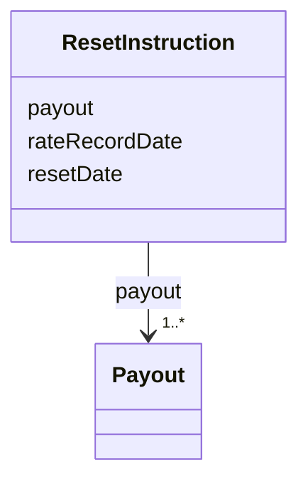

```mermaid
 classDiagram
    class ResetInstruction
    click ResetInstruction href "../ResetInstruction"
      ResetInstruction : payout
        
          
    
        
        
        ResetInstruction --> "1..*" Payout : payout
        click Payout href "../Payout"
    

        
      ResetInstruction : rateRecordDate
        
      ResetInstruction : resetDate
        
      
```
