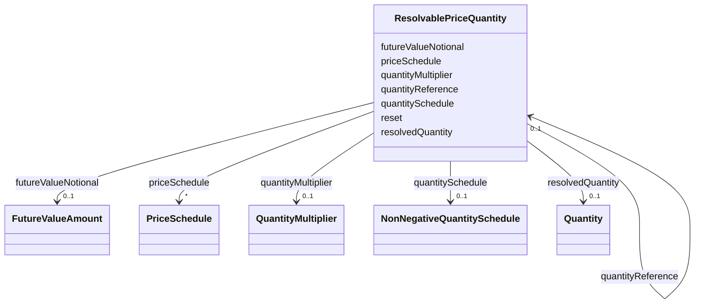

```mermaid
 classDiagram
    class ResolvablePriceQuantity
    click ResolvablePriceQuantity href "../ResolvablePriceQuantity"
      ResolvablePriceQuantity : futureValueNotional
        
          
    
        
        
        ResolvablePriceQuantity --> "0..1" FutureValueAmount : futureValueNotional
        click FutureValueAmount href "../FutureValueAmount"
    

        
      ResolvablePriceQuantity : priceSchedule
        
          
    
        
        
        ResolvablePriceQuantity --> "*" PriceSchedule : priceSchedule
        click PriceSchedule href "../PriceSchedule"
    

        
      ResolvablePriceQuantity : quantityMultiplier
        
          
    
        
        
        ResolvablePriceQuantity --> "0..1" QuantityMultiplier : quantityMultiplier
        click QuantityMultiplier href "../QuantityMultiplier"
    

        
      ResolvablePriceQuantity : quantityReference
        
          
    
        
        
        ResolvablePriceQuantity --> "0..1" ResolvablePriceQuantity : quantityReference
        click ResolvablePriceQuantity href "../ResolvablePriceQuantity"
    

        
      ResolvablePriceQuantity : quantitySchedule
        
          
    
        
        
        ResolvablePriceQuantity --> "0..1" NonNegativeQuantitySchedule : quantitySchedule
        click NonNegativeQuantitySchedule href "../NonNegativeQuantitySchedule"
    

        
      ResolvablePriceQuantity : reset
        
      ResolvablePriceQuantity : resolvedQuantity
        
          
    
        
        
        ResolvablePriceQuantity --> "0..1" Quantity : resolvedQuantity
        click Quantity href "../Quantity"
    

        
      
```
