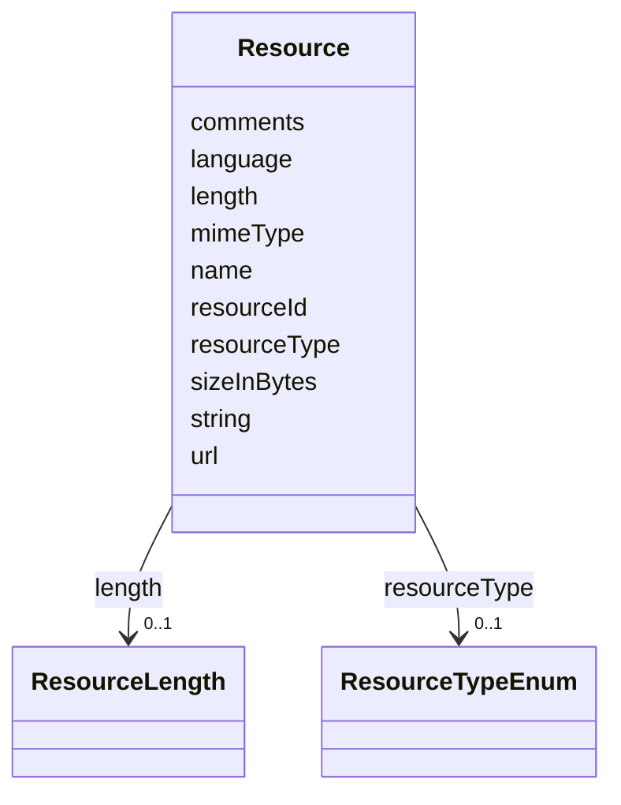

```mermaid
 classDiagram
    class Resource
    click Resource href "../Resource"
      Resource : comments
        
      Resource : language
        
      Resource : length
        
          
    
        
        
        Resource --> "0..1" ResourceLength : length
        click ResourceLength href "../ResourceLength"
    

        
      Resource : mimeType
        
      Resource : name
        
      Resource : resourceId
        
      Resource : resourceType
        
          
    
        
        
        Resource --> "0..1" ResourceTypeEnum : resourceType
        click ResourceTypeEnum href "../ResourceTypeEnum"
    

        
      Resource : sizeInBytes
        
      Resource : string
        
      Resource : url
        
      
```
