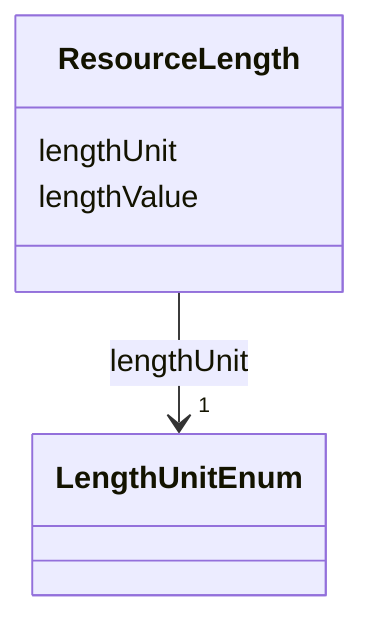

```mermaid
 classDiagram
    class ResourceLength
    click ResourceLength href "../ResourceLength"
      ResourceLength : lengthUnit
        
          
    
        
        
        ResourceLength --> "1" LengthUnitEnum : lengthUnit
        click LengthUnitEnum href "../LengthUnitEnum"
    

        
      ResourceLength : lengthValue
        
      
```
