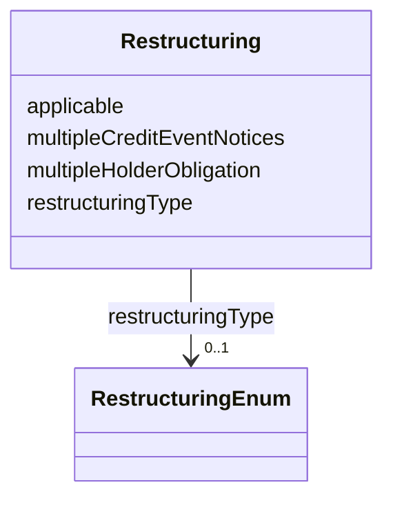

```mermaid
 classDiagram
    class Restructuring
    click Restructuring href "../Restructuring"
      Restructuring : applicable
        
      Restructuring : multipleCreditEventNotices
        
      Restructuring : multipleHolderObligation
        
      Restructuring : restructuringType
        
          
    
        
        
        Restructuring --> "0..1" RestructuringEnum : restructuringType
        click RestructuringEnum href "../RestructuringEnum"
    

        
      
```
