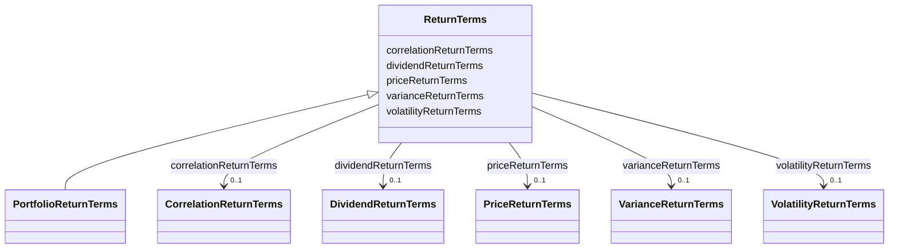

```mermaid
 classDiagram
    class ReturnTerms
    click ReturnTerms href "../ReturnTerms"
      ReturnTerms <|-- PortfolioReturnTerms
        click PortfolioReturnTerms href "../PortfolioReturnTerms"
      
      ReturnTerms : correlationReturnTerms
        
          
    
        
        
        ReturnTerms --> "0..1" CorrelationReturnTerms : correlationReturnTerms
        click CorrelationReturnTerms href "../CorrelationReturnTerms"
    

        
      ReturnTerms : dividendReturnTerms
        
          
    
        
        
        ReturnTerms --> "0..1" DividendReturnTerms : dividendReturnTerms
        click DividendReturnTerms href "../DividendReturnTerms"
    

        
      ReturnTerms : priceReturnTerms
        
          
    
        
        
        ReturnTerms --> "0..1" PriceReturnTerms : priceReturnTerms
        click PriceReturnTerms href "../PriceReturnTerms"
    

        
      ReturnTerms : varianceReturnTerms
        
          
    
        
        
        ReturnTerms --> "0..1" VarianceReturnTerms : varianceReturnTerms
        click VarianceReturnTerms href "../VarianceReturnTerms"
    

        
      ReturnTerms : volatilityReturnTerms
        
          
    
        
        
        ReturnTerms --> "0..1" VolatilityReturnTerms : volatilityReturnTerms
        click VolatilityReturnTerms href "../VolatilityReturnTerms"
    

        
      
```
