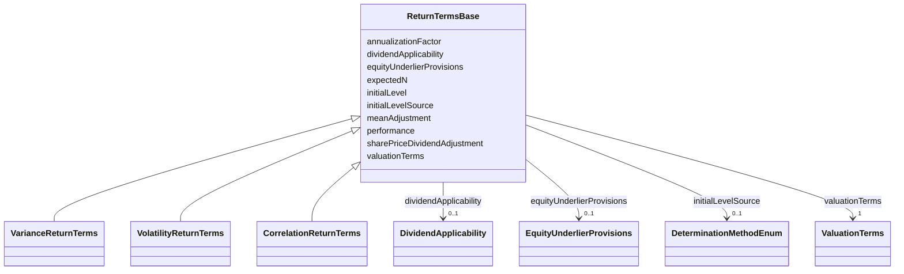

```mermaid
 classDiagram
    class ReturnTermsBase
    click ReturnTermsBase href "../ReturnTermsBase"
      ReturnTermsBase <|-- VarianceReturnTerms
        click VarianceReturnTerms href "../VarianceReturnTerms"
      ReturnTermsBase <|-- VolatilityReturnTerms
        click VolatilityReturnTerms href "../VolatilityReturnTerms"
      ReturnTermsBase <|-- CorrelationReturnTerms
        click CorrelationReturnTerms href "../CorrelationReturnTerms"
      
      ReturnTermsBase : annualizationFactor
        
      ReturnTermsBase : dividendApplicability
        
          
    
        
        
        ReturnTermsBase --> "0..1" DividendApplicability : dividendApplicability
        click DividendApplicability href "../DividendApplicability"
    

        
      ReturnTermsBase : equityUnderlierProvisions
        
          
    
        
        
        ReturnTermsBase --> "0..1" EquityUnderlierProvisions : equityUnderlierProvisions
        click EquityUnderlierProvisions href "../EquityUnderlierProvisions"
    

        
      ReturnTermsBase : expectedN
        
      ReturnTermsBase : initialLevel
        
      ReturnTermsBase : initialLevelSource
        
          
    
        
        
        ReturnTermsBase --> "0..1" DeterminationMethodEnum : initialLevelSource
        click DeterminationMethodEnum href "../DeterminationMethodEnum"
    

        
      ReturnTermsBase : meanAdjustment
        
      ReturnTermsBase : performance
        
      ReturnTermsBase : sharePriceDividendAdjustment
        
      ReturnTermsBase : valuationTerms
        
          
    
        
        
        ReturnTermsBase --> "1" ValuationTerms : valuationTerms
        click ValuationTerms href "../ValuationTerms"
    

        
      
```
