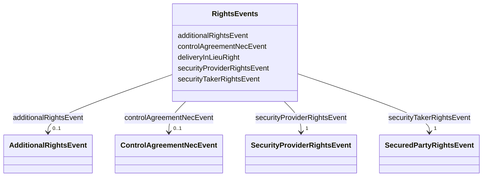

```mermaid
 classDiagram
    class RightsEvents
    click RightsEvents href "../RightsEvents"
      RightsEvents : additionalRightsEvent
        
          
    
        
        
        RightsEvents --> "0..1" AdditionalRightsEvent : additionalRightsEvent
        click AdditionalRightsEvent href "../AdditionalRightsEvent"
    

        
      RightsEvents : controlAgreementNecEvent
        
          
    
        
        
        RightsEvents --> "0..1" ControlAgreementNecEvent : controlAgreementNecEvent
        click ControlAgreementNecEvent href "../ControlAgreementNecEvent"
    

        
      RightsEvents : deliveryInLieuRight
        
      RightsEvents : securityProviderRightsEvent
        
          
    
        
        
        RightsEvents --> "1" SecurityProviderRightsEvent : securityProviderRightsEvent
        click SecurityProviderRightsEvent href "../SecurityProviderRightsEvent"
    

        
      RightsEvents : securityTakerRightsEvent
        
          
    
        
        
        RightsEvents --> "1" SecuredPartyRightsEvent : securityTakerRightsEvent
        click SecuredPartyRightsEvent href "../SecuredPartyRightsEvent"
    

        
      
```
