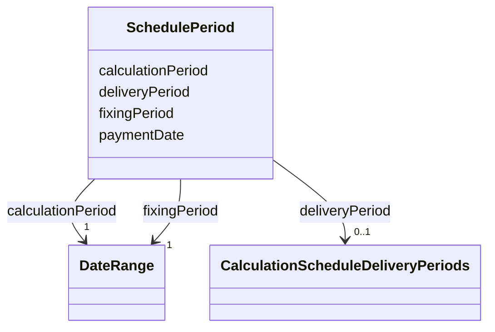

```mermaid
 classDiagram
    class SchedulePeriod
    click SchedulePeriod href "../SchedulePeriod"
      SchedulePeriod : calculationPeriod
        
          
    
        
        
        SchedulePeriod --> "1" DateRange : calculationPeriod
        click DateRange href "../DateRange"
    

        
      SchedulePeriod : deliveryPeriod
        
          
    
        
        
        SchedulePeriod --> "0..1" CalculationScheduleDeliveryPeriods : deliveryPeriod
        click CalculationScheduleDeliveryPeriods href "../CalculationScheduleDeliveryPeriods"
    

        
      SchedulePeriod : fixingPeriod
        
          
    
        
        
        SchedulePeriod --> "1" DateRange : fixingPeriod
        click DateRange href "../DateRange"
    

        
      SchedulePeriod : paymentDate
        
      
```
