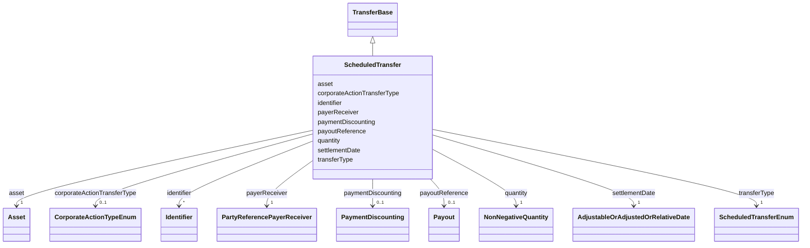

```mermaid
 classDiagram
    class ScheduledTransfer
    click ScheduledTransfer href "../ScheduledTransfer"
      TransferBase <|-- ScheduledTransfer
        click TransferBase href "../TransferBase"
      
      ScheduledTransfer : asset
        
          
    
        
        
        ScheduledTransfer --> "1" Asset : asset
        click Asset href "../Asset"
    

        
      ScheduledTransfer : corporateActionTransferType
        
          
    
        
        
        ScheduledTransfer --> "0..1" CorporateActionTypeEnum : corporateActionTransferType
        click CorporateActionTypeEnum href "../CorporateActionTypeEnum"
    

        
      ScheduledTransfer : identifier
        
          
    
        
        
        ScheduledTransfer --> "*" Identifier : identifier
        click Identifier href "../Identifier"
    

        
      ScheduledTransfer : payerReceiver
        
          
    
        
        
        ScheduledTransfer --> "1" PartyReferencePayerReceiver : payerReceiver
        click PartyReferencePayerReceiver href "../PartyReferencePayerReceiver"
    

        
      ScheduledTransfer : paymentDiscounting
        
          
    
        
        
        ScheduledTransfer --> "0..1" PaymentDiscounting : paymentDiscounting
        click PaymentDiscounting href "../PaymentDiscounting"
    

        
      ScheduledTransfer : payoutReference
        
          
    
        
        
        ScheduledTransfer --> "0..1" Payout : payoutReference
        click Payout href "../Payout"
    

        
      ScheduledTransfer : quantity
        
          
    
        
        
        ScheduledTransfer --> "1" NonNegativeQuantity : quantity
        click NonNegativeQuantity href "../NonNegativeQuantity"
    

        
      ScheduledTransfer : settlementDate
        
          
    
        
        
        ScheduledTransfer --> "1" AdjustableOrAdjustedOrRelativeDate : settlementDate
        click AdjustableOrAdjustedOrRelativeDate href "../AdjustableOrAdjustedOrRelativeDate"
    

        
      ScheduledTransfer : transferType
        
          
    
        
        
        ScheduledTransfer --> "1" ScheduledTransferEnum : transferType
        click ScheduledTransferEnum href "../ScheduledTransferEnum"
    

        
      
```
