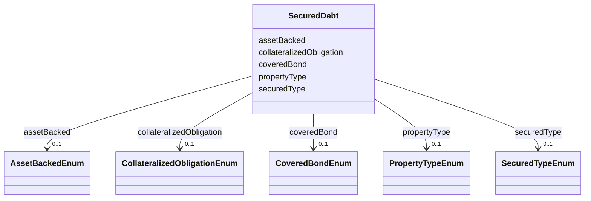

```mermaid
 classDiagram
    class SecuredDebt
    click SecuredDebt href "../SecuredDebt"
      SecuredDebt : assetBacked
        
          
    
        
        
        SecuredDebt --> "0..1" AssetBackedEnum : assetBacked
        click AssetBackedEnum href "../AssetBackedEnum"
    

        
      SecuredDebt : collateralizedObligation
        
          
    
        
        
        SecuredDebt --> "0..1" CollateralizedObligationEnum : collateralizedObligation
        click CollateralizedObligationEnum href "../CollateralizedObligationEnum"
    

        
      SecuredDebt : coveredBond
        
          
    
        
        
        SecuredDebt --> "0..1" CoveredBondEnum : coveredBond
        click CoveredBondEnum href "../CoveredBondEnum"
    

        
      SecuredDebt : propertyType
        
          
    
        
        
        SecuredDebt --> "0..1" PropertyTypeEnum : propertyType
        click PropertyTypeEnum href "../PropertyTypeEnum"
    

        
      SecuredDebt : securedType
        
          
    
        
        
        SecuredDebt --> "0..1" SecuredTypeEnum : securedType
        click SecuredTypeEnum href "../SecuredTypeEnum"
    

        
      
```
