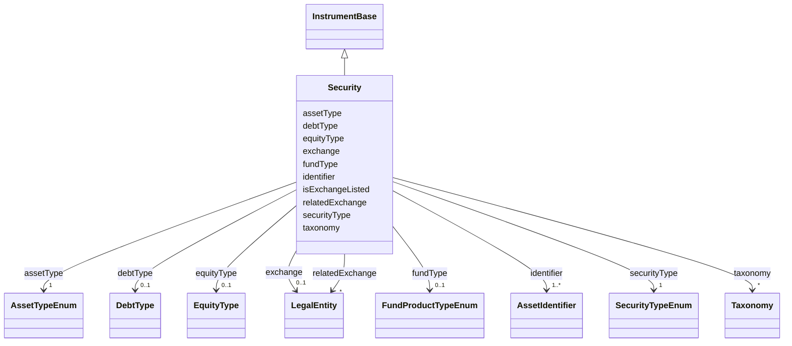

```mermaid
 classDiagram
    class Security
    click Security href "../Security"
      InstrumentBase <|-- Security
        click InstrumentBase href "../InstrumentBase"
      
      Security : assetType
        
          
    
        
        
        Security --> "1" AssetTypeEnum : assetType
        click AssetTypeEnum href "../AssetTypeEnum"
    

        
      Security : debtType
        
          
    
        
        
        Security --> "0..1" DebtType : debtType
        click DebtType href "../DebtType"
    

        
      Security : equityType
        
          
    
        
        
        Security --> "0..1" EquityType : equityType
        click EquityType href "../EquityType"
    

        
      Security : exchange
        
          
    
        
        
        Security --> "0..1" LegalEntity : exchange
        click LegalEntity href "../LegalEntity"
    

        
      Security : fundType
        
          
    
        
        
        Security --> "0..1" FundProductTypeEnum : fundType
        click FundProductTypeEnum href "../FundProductTypeEnum"
    

        
      Security : identifier
        
          
    
        
        
        Security --> "1..*" AssetIdentifier : identifier
        click AssetIdentifier href "../AssetIdentifier"
    

        
      Security : isExchangeListed
        
      Security : relatedExchange
        
          
    
        
        
        Security --> "*" LegalEntity : relatedExchange
        click LegalEntity href "../LegalEntity"
    

        
      Security : securityType
        
          
    
        
        
        Security --> "1" SecurityTypeEnum : securityType
        click SecurityTypeEnum href "../SecurityTypeEnum"
    

        
      Security : taxonomy
        
          
    
        
        
        Security --> "*" Taxonomy : taxonomy
        click Taxonomy href "../Taxonomy"
    

        
      
```
