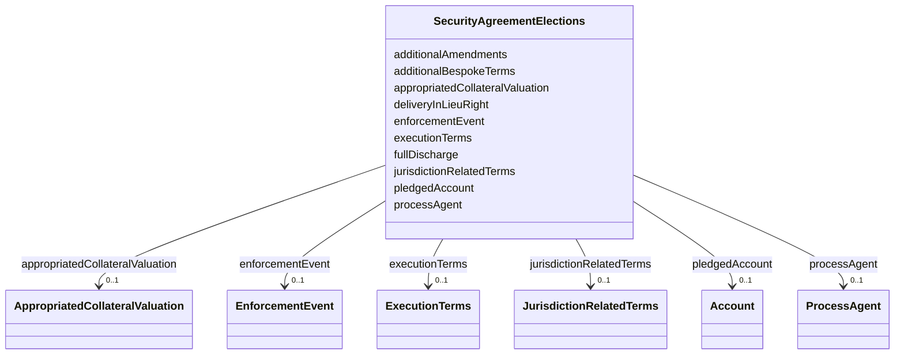

```mermaid
 classDiagram
    class SecurityAgreementElections
    click SecurityAgreementElections href "../SecurityAgreementElections"
      SecurityAgreementElections : additionalAmendments
        
      SecurityAgreementElections : additionalBespokeTerms
        
      SecurityAgreementElections : appropriatedCollateralValuation
        
          
    
        
        
        SecurityAgreementElections --> "0..1" AppropriatedCollateralValuation : appropriatedCollateralValuation
        click AppropriatedCollateralValuation href "../AppropriatedCollateralValuation"
    

        
      SecurityAgreementElections : deliveryInLieuRight
        
      SecurityAgreementElections : enforcementEvent
        
          
    
        
        
        SecurityAgreementElections --> "0..1" EnforcementEvent : enforcementEvent
        click EnforcementEvent href "../EnforcementEvent"
    

        
      SecurityAgreementElections : executionTerms
        
          
    
        
        
        SecurityAgreementElections --> "0..1" ExecutionTerms : executionTerms
        click ExecutionTerms href "../ExecutionTerms"
    

        
      SecurityAgreementElections : fullDischarge
        
      SecurityAgreementElections : jurisdictionRelatedTerms
        
          
    
        
        
        SecurityAgreementElections --> "0..1" JurisdictionRelatedTerms : jurisdictionRelatedTerms
        click JurisdictionRelatedTerms href "../JurisdictionRelatedTerms"
    

        
      SecurityAgreementElections : pledgedAccount
        
          
    
        
        
        SecurityAgreementElections --> "0..1" Account : pledgedAccount
        click Account href "../Account"
    

        
      SecurityAgreementElections : processAgent
        
          
    
        
        
        SecurityAgreementElections --> "0..1" ProcessAgent : processAgent
        click ProcessAgent href "../ProcessAgent"
    

        
      
```
