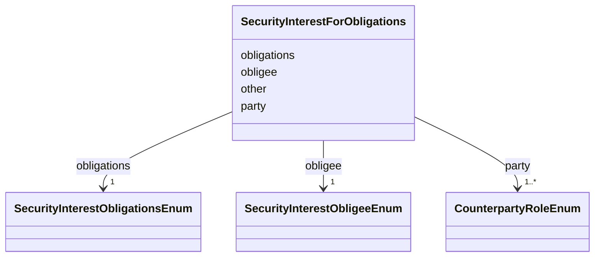

```mermaid
 classDiagram
    class SecurityInterestForObligations
    click SecurityInterestForObligations href "../SecurityInterestForObligations"
      SecurityInterestForObligations : obligations
        
          
    
        
        
        SecurityInterestForObligations --> "1" SecurityInterestObligationsEnum : obligations
        click SecurityInterestObligationsEnum href "../SecurityInterestObligationsEnum"
    

        
      SecurityInterestForObligations : obligee
        
          
    
        
        
        SecurityInterestForObligations --> "1" SecurityInterestObligeeEnum : obligee
        click SecurityInterestObligeeEnum href "../SecurityInterestObligeeEnum"
    

        
      SecurityInterestForObligations : other
        
      SecurityInterestForObligations : party
        
          
    
        
        
        SecurityInterestForObligations --> "1..*" CounterpartyRoleEnum : party
        click CounterpartyRoleEnum href "../CounterpartyRoleEnum"
    

        
      
```
