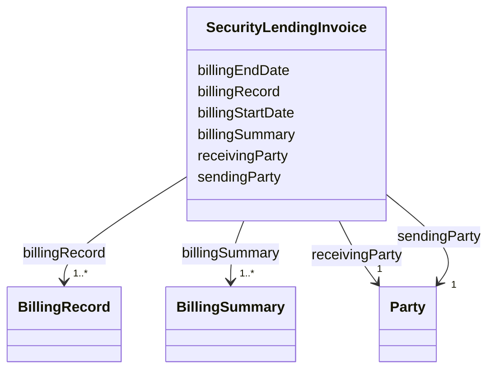

```mermaid
 classDiagram
    class SecurityLendingInvoice
    click SecurityLendingInvoice href "../SecurityLendingInvoice"
      SecurityLendingInvoice : billingEndDate
        
      SecurityLendingInvoice : billingRecord
        
          
    
        
        
        SecurityLendingInvoice --> "1..*" BillingRecord : billingRecord
        click BillingRecord href "../BillingRecord"
    

        
      SecurityLendingInvoice : billingStartDate
        
      SecurityLendingInvoice : billingSummary
        
          
    
        
        
        SecurityLendingInvoice --> "1..*" BillingSummary : billingSummary
        click BillingSummary href "../BillingSummary"
    

        
      SecurityLendingInvoice : receivingParty
        
          
    
        
        
        SecurityLendingInvoice --> "1" Party : receivingParty
        click Party href "../Party"
    

        
      SecurityLendingInvoice : sendingParty
        
          
    
        
        
        SecurityLendingInvoice --> "1" Party : sendingParty
        click Party href "../Party"
    

        
      
```
