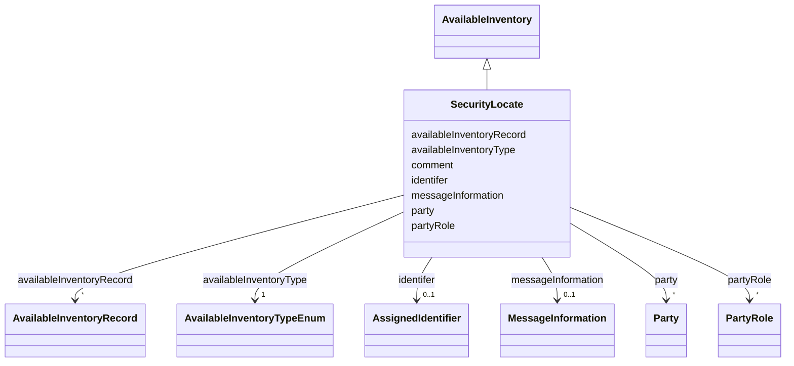

```mermaid
 classDiagram
    class SecurityLocate
    click SecurityLocate href "../SecurityLocate"
      AvailableInventory <|-- SecurityLocate
        click AvailableInventory href "../AvailableInventory"
      
      SecurityLocate : availableInventoryRecord
        
          
    
        
        
        SecurityLocate --> "*" AvailableInventoryRecord : availableInventoryRecord
        click AvailableInventoryRecord href "../AvailableInventoryRecord"
    

        
      SecurityLocate : availableInventoryType
        
          
    
        
        
        SecurityLocate --> "1" AvailableInventoryTypeEnum : availableInventoryType
        click AvailableInventoryTypeEnum href "../AvailableInventoryTypeEnum"
    

        
      SecurityLocate : comment
        
      SecurityLocate : identifer
        
          
    
        
        
        SecurityLocate --> "0..1" AssignedIdentifier : identifer
        click AssignedIdentifier href "../AssignedIdentifier"
    

        
      SecurityLocate : messageInformation
        
          
    
        
        
        SecurityLocate --> "0..1" MessageInformation : messageInformation
        click MessageInformation href "../MessageInformation"
    

        
      SecurityLocate : party
        
          
    
        
        
        SecurityLocate --> "*" Party : party
        click Party href "../Party"
    

        
      SecurityLocate : partyRole
        
          
    
        
        
        SecurityLocate --> "*" PartyRole : partyRole
        click PartyRole href "../PartyRole"
    

        
      
```
