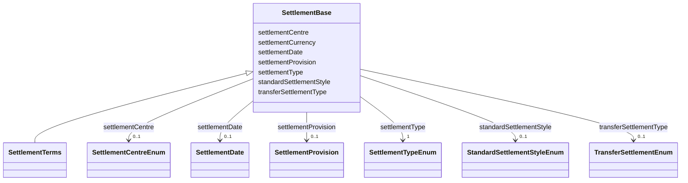

```mermaid
 classDiagram
    class SettlementBase
    click SettlementBase href "../SettlementBase"
      SettlementBase <|-- SettlementTerms
        click SettlementTerms href "../SettlementTerms"
      
      SettlementBase : settlementCentre
        
          
    
        
        
        SettlementBase --> "0..1" SettlementCentreEnum : settlementCentre
        click SettlementCentreEnum href "../SettlementCentreEnum"
    

        
      SettlementBase : settlementCurrency
        
      SettlementBase : settlementDate
        
          
    
        
        
        SettlementBase --> "0..1" SettlementDate : settlementDate
        click SettlementDate href "../SettlementDate"
    

        
      SettlementBase : settlementProvision
        
          
    
        
        
        SettlementBase --> "0..1" SettlementProvision : settlementProvision
        click SettlementProvision href "../SettlementProvision"
    

        
      SettlementBase : settlementType
        
          
    
        
        
        SettlementBase --> "1" SettlementTypeEnum : settlementType
        click SettlementTypeEnum href "../SettlementTypeEnum"
    

        
      SettlementBase : standardSettlementStyle
        
          
    
        
        
        SettlementBase --> "0..1" StandardSettlementStyleEnum : standardSettlementStyle
        click StandardSettlementStyleEnum href "../StandardSettlementStyleEnum"
    

        
      SettlementBase : transferSettlementType
        
          
    
        
        
        SettlementBase --> "0..1" TransferSettlementEnum : transferSettlementType
        click TransferSettlementEnum href "../TransferSettlementEnum"
    

        
      
```
