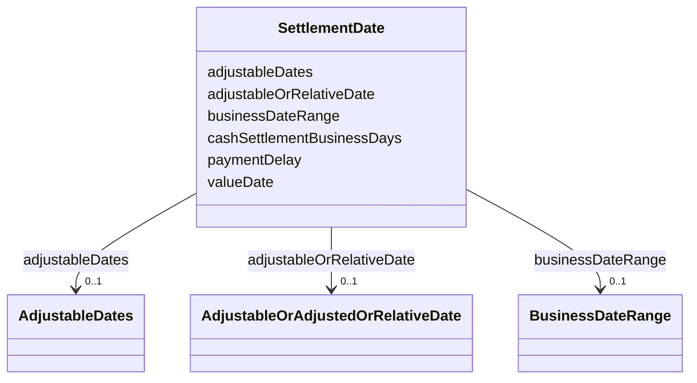

```mermaid
 classDiagram
    class SettlementDate
    click SettlementDate href "../SettlementDate"
      SettlementDate : adjustableDates
        
          
    
        
        
        SettlementDate --> "0..1" AdjustableDates : adjustableDates
        click AdjustableDates href "../AdjustableDates"
    

        
      SettlementDate : adjustableOrRelativeDate
        
          
    
        
        
        SettlementDate --> "0..1" AdjustableOrAdjustedOrRelativeDate : adjustableOrRelativeDate
        click AdjustableOrAdjustedOrRelativeDate href "../AdjustableOrAdjustedOrRelativeDate"
    

        
      SettlementDate : businessDateRange
        
          
    
        
        
        SettlementDate --> "0..1" BusinessDateRange : businessDateRange
        click BusinessDateRange href "../BusinessDateRange"
    

        
      SettlementDate : cashSettlementBusinessDays
        
      SettlementDate : paymentDelay
        
      SettlementDate : valueDate
        
      
```
