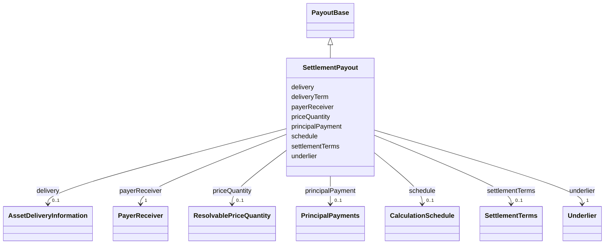

```mermaid
 classDiagram
    class SettlementPayout
    click SettlementPayout href "../SettlementPayout"
      PayoutBase <|-- SettlementPayout
        click PayoutBase href "../PayoutBase"
      
      SettlementPayout : delivery
        
          
    
        
        
        SettlementPayout --> "0..1" AssetDeliveryInformation : delivery
        click AssetDeliveryInformation href "../AssetDeliveryInformation"
    

        
      SettlementPayout : deliveryTerm
        
      SettlementPayout : payerReceiver
        
          
    
        
        
        SettlementPayout --> "1" PayerReceiver : payerReceiver
        click PayerReceiver href "../PayerReceiver"
    

        
      SettlementPayout : priceQuantity
        
          
    
        
        
        SettlementPayout --> "0..1" ResolvablePriceQuantity : priceQuantity
        click ResolvablePriceQuantity href "../ResolvablePriceQuantity"
    

        
      SettlementPayout : principalPayment
        
          
    
        
        
        SettlementPayout --> "0..1" PrincipalPayments : principalPayment
        click PrincipalPayments href "../PrincipalPayments"
    

        
      SettlementPayout : schedule
        
          
    
        
        
        SettlementPayout --> "0..1" CalculationSchedule : schedule
        click CalculationSchedule href "../CalculationSchedule"
    

        
      SettlementPayout : settlementTerms
        
          
    
        
        
        SettlementPayout --> "0..1" SettlementTerms : settlementTerms
        click SettlementTerms href "../SettlementTerms"
    

        
      SettlementPayout : underlier
        
          
    
        
        
        SettlementPayout --> "1" Underlier : underlier
        click Underlier href "../Underlier"
    

        
      
```
