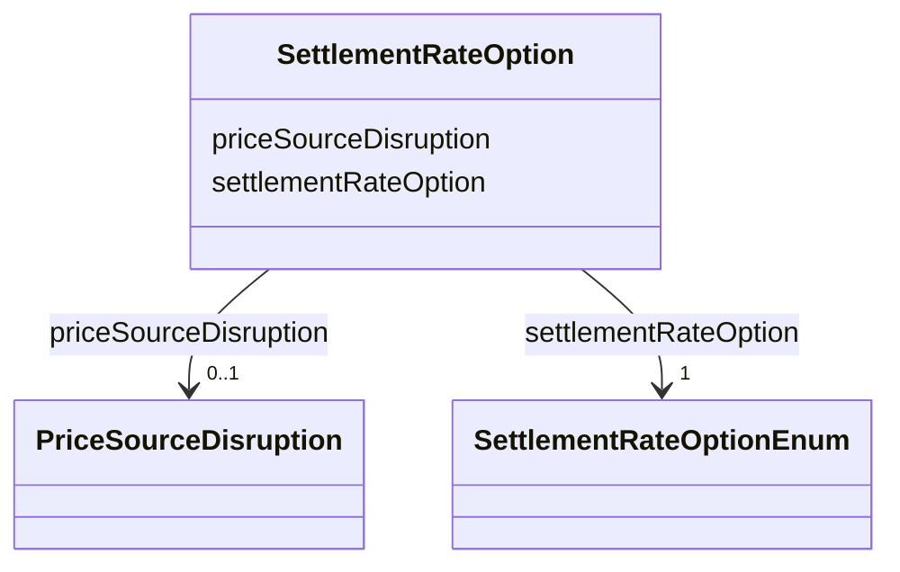

```mermaid
 classDiagram
    class SettlementRateOption
    click SettlementRateOption href "../SettlementRateOption"
      SettlementRateOption : priceSourceDisruption
        
          
    
        
        
        SettlementRateOption --> "0..1" PriceSourceDisruption : priceSourceDisruption
        click PriceSourceDisruption href "../PriceSourceDisruption"
    

        
      SettlementRateOption : settlementRateOption
        
          
    
        
        
        SettlementRateOption --> "1" SettlementRateOptionEnum : settlementRateOption
        click SettlementRateOptionEnum href "../SettlementRateOptionEnum"
    

        
      
```
