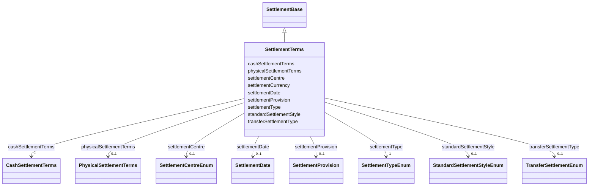

```mermaid
 classDiagram
    class SettlementTerms
    click SettlementTerms href "../SettlementTerms"
      SettlementBase <|-- SettlementTerms
        click SettlementBase href "../SettlementBase"
      
      SettlementTerms : cashSettlementTerms
        
          
    
        
        
        SettlementTerms --> "*" CashSettlementTerms : cashSettlementTerms
        click CashSettlementTerms href "../CashSettlementTerms"
    

        
      SettlementTerms : physicalSettlementTerms
        
          
    
        
        
        SettlementTerms --> "0..1" PhysicalSettlementTerms : physicalSettlementTerms
        click PhysicalSettlementTerms href "../PhysicalSettlementTerms"
    

        
      SettlementTerms : settlementCentre
        
          
    
        
        
        SettlementTerms --> "0..1" SettlementCentreEnum : settlementCentre
        click SettlementCentreEnum href "../SettlementCentreEnum"
    

        
      SettlementTerms : settlementCurrency
        
      SettlementTerms : settlementDate
        
          
    
        
        
        SettlementTerms --> "0..1" SettlementDate : settlementDate
        click SettlementDate href "../SettlementDate"
    

        
      SettlementTerms : settlementProvision
        
          
    
        
        
        SettlementTerms --> "0..1" SettlementProvision : settlementProvision
        click SettlementProvision href "../SettlementProvision"
    

        
      SettlementTerms : settlementType
        
          
    
        
        
        SettlementTerms --> "1" SettlementTypeEnum : settlementType
        click SettlementTypeEnum href "../SettlementTypeEnum"
    

        
      SettlementTerms : standardSettlementStyle
        
          
    
        
        
        SettlementTerms --> "0..1" StandardSettlementStyleEnum : standardSettlementStyle
        click StandardSettlementStyleEnum href "../StandardSettlementStyleEnum"
    

        
      SettlementTerms : transferSettlementType
        
          
    
        
        
        SettlementTerms --> "0..1" TransferSettlementEnum : transferSettlementType
        click TransferSettlementEnum href "../TransferSettlementEnum"
    

        
      
```
