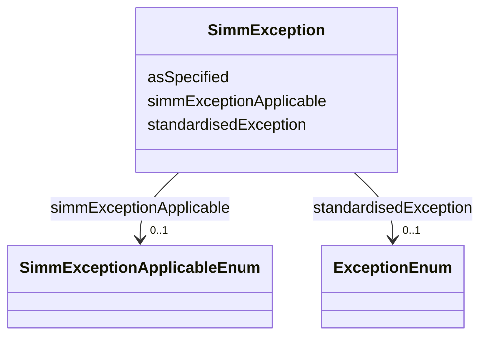

```mermaid
 classDiagram
    class SimmException
    click SimmException href "../SimmException"
      SimmException : asSpecified
        
      SimmException : simmExceptionApplicable
        
          
    
        
        
        SimmException --> "0..1" SimmExceptionApplicableEnum : simmExceptionApplicable
        click SimmExceptionApplicableEnum href "../SimmExceptionApplicableEnum"
    

        
      SimmException : standardisedException
        
          
    
        
        
        SimmException --> "0..1" ExceptionEnum : standardisedException
        click ExceptionEnum href "../ExceptionEnum"
    

        
      
```
