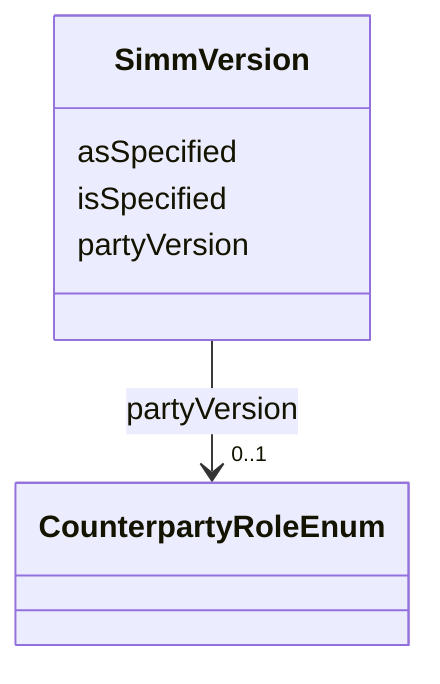

```mermaid
 classDiagram
    class SimmVersion
    click SimmVersion href "../SimmVersion"
      SimmVersion : asSpecified
        
      SimmVersion : isSpecified
        
      SimmVersion : partyVersion
        
          
    
        
        
        SimmVersion --> "0..1" CounterpartyRoleEnum : partyVersion
        click CounterpartyRoleEnum href "../CounterpartyRoleEnum"
    

        
      
```
