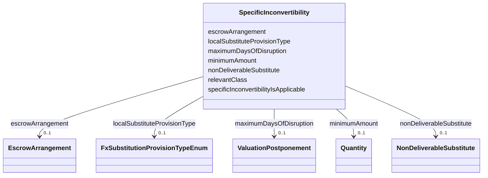

```mermaid
 classDiagram
    class SpecificInconvertibility
    click SpecificInconvertibility href "../SpecificInconvertibility"
      SpecificInconvertibility : escrowArrangement
        
          
    
        
        
        SpecificInconvertibility --> "0..1" EscrowArrangement : escrowArrangement
        click EscrowArrangement href "../EscrowArrangement"
    

        
      SpecificInconvertibility : localSubstituteProvisionType
        
          
    
        
        
        SpecificInconvertibility --> "0..1" FxSubstitutionProvisionTypeEnum : localSubstituteProvisionType
        click FxSubstitutionProvisionTypeEnum href "../FxSubstitutionProvisionTypeEnum"
    

        
      SpecificInconvertibility : maximumDaysOfDisruption
        
          
    
        
        
        SpecificInconvertibility --> "0..1" ValuationPostponement : maximumDaysOfDisruption
        click ValuationPostponement href "../ValuationPostponement"
    

        
      SpecificInconvertibility : minimumAmount
        
          
    
        
        
        SpecificInconvertibility --> "0..1" Quantity : minimumAmount
        click Quantity href "../Quantity"
    

        
      SpecificInconvertibility : nonDeliverableSubstitute
        
          
    
        
        
        SpecificInconvertibility --> "0..1" NonDeliverableSubstitute : nonDeliverableSubstitute
        click NonDeliverableSubstitute href "../NonDeliverableSubstitute"
    

        
      SpecificInconvertibility : relevantClass
        
      SpecificInconvertibility : specificInconvertibilityIsApplicable
        
      
```
