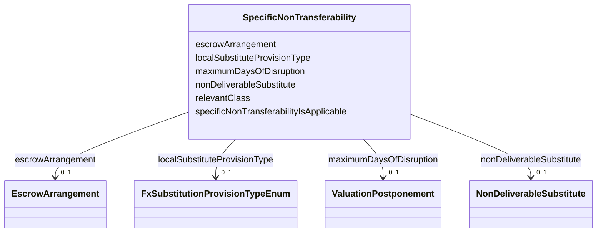

```mermaid
 classDiagram
    class SpecificNonTransferability
    click SpecificNonTransferability href "../SpecificNonTransferability"
      SpecificNonTransferability : escrowArrangement
        
          
    
        
        
        SpecificNonTransferability --> "0..1" EscrowArrangement : escrowArrangement
        click EscrowArrangement href "../EscrowArrangement"
    

        
      SpecificNonTransferability : localSubstituteProvisionType
        
          
    
        
        
        SpecificNonTransferability --> "0..1" FxSubstitutionProvisionTypeEnum : localSubstituteProvisionType
        click FxSubstitutionProvisionTypeEnum href "../FxSubstitutionProvisionTypeEnum"
    

        
      SpecificNonTransferability : maximumDaysOfDisruption
        
          
    
        
        
        SpecificNonTransferability --> "0..1" ValuationPostponement : maximumDaysOfDisruption
        click ValuationPostponement href "../ValuationPostponement"
    

        
      SpecificNonTransferability : nonDeliverableSubstitute
        
          
    
        
        
        SpecificNonTransferability --> "0..1" NonDeliverableSubstitute : nonDeliverableSubstitute
        click NonDeliverableSubstitute href "../NonDeliverableSubstitute"
    

        
      SpecificNonTransferability : relevantClass
        
      SpecificNonTransferability : specificNonTransferabilityIsApplicable
        
      
```
