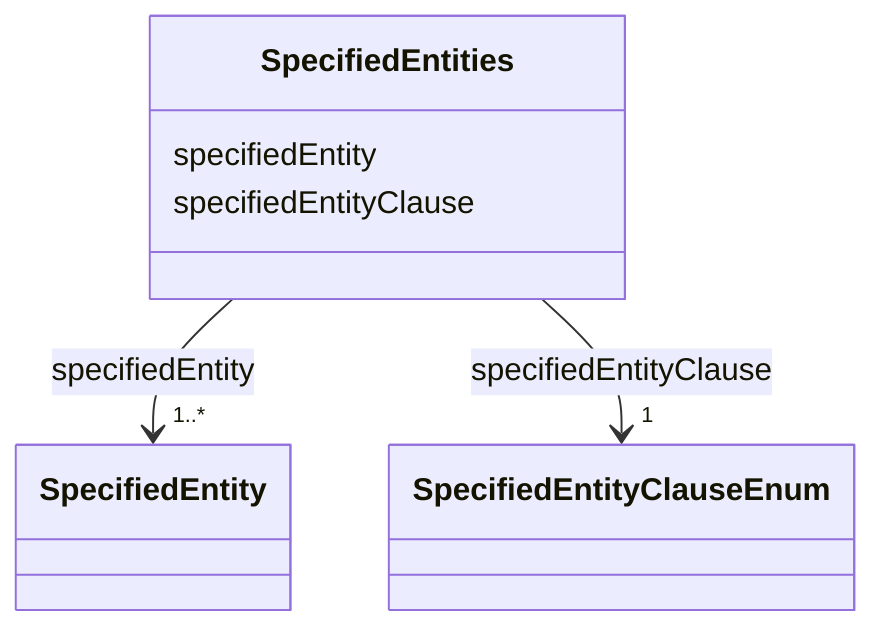

```mermaid
 classDiagram
    class SpecifiedEntities
    click SpecifiedEntities href "../SpecifiedEntities"
      SpecifiedEntities : specifiedEntity
        
          
    
        
        
        SpecifiedEntities --> "1..*" SpecifiedEntity : specifiedEntity
        click SpecifiedEntity href "../SpecifiedEntity"
    

        
      SpecifiedEntities : specifiedEntityClause
        
          
    
        
        
        SpecifiedEntities --> "1" SpecifiedEntityClauseEnum : specifiedEntityClause
        click SpecifiedEntityClauseEnum href "../SpecifiedEntityClauseEnum"
    

        
      
```
