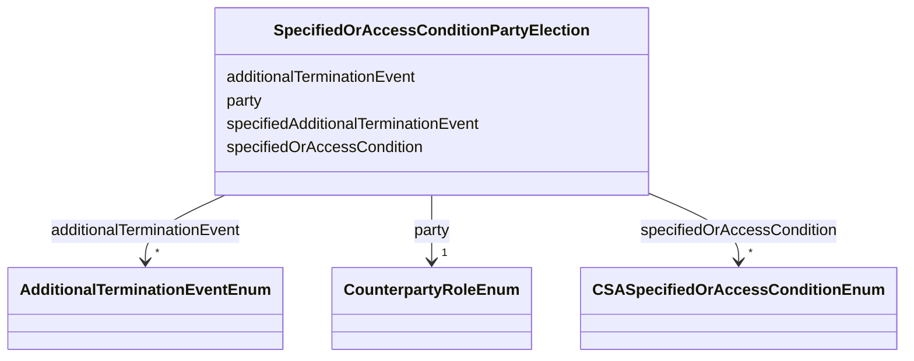

```mermaid
 classDiagram
    class SpecifiedOrAccessConditionPartyElection
    click SpecifiedOrAccessConditionPartyElection href "../SpecifiedOrAccessConditionPartyElection"
      SpecifiedOrAccessConditionPartyElection : additionalTerminationEvent
        
          
    
        
        
        SpecifiedOrAccessConditionPartyElection --> "*" AdditionalTerminationEventEnum : additionalTerminationEvent
        click AdditionalTerminationEventEnum href "../AdditionalTerminationEventEnum"
    

        
      SpecifiedOrAccessConditionPartyElection : party
        
          
    
        
        
        SpecifiedOrAccessConditionPartyElection --> "1" CounterpartyRoleEnum : party
        click CounterpartyRoleEnum href "../CounterpartyRoleEnum"
    

        
      SpecifiedOrAccessConditionPartyElection : specifiedAdditionalTerminationEvent
        
      SpecifiedOrAccessConditionPartyElection : specifiedOrAccessCondition
        
          
    
        
        
        SpecifiedOrAccessConditionPartyElection --> "*" CSASpecifiedOrAccessConditionEnum : specifiedOrAccessCondition
        click CSASpecifiedOrAccessConditionEnum href "../CSASpecifiedOrAccessConditionEnum"
    

        
      
```
