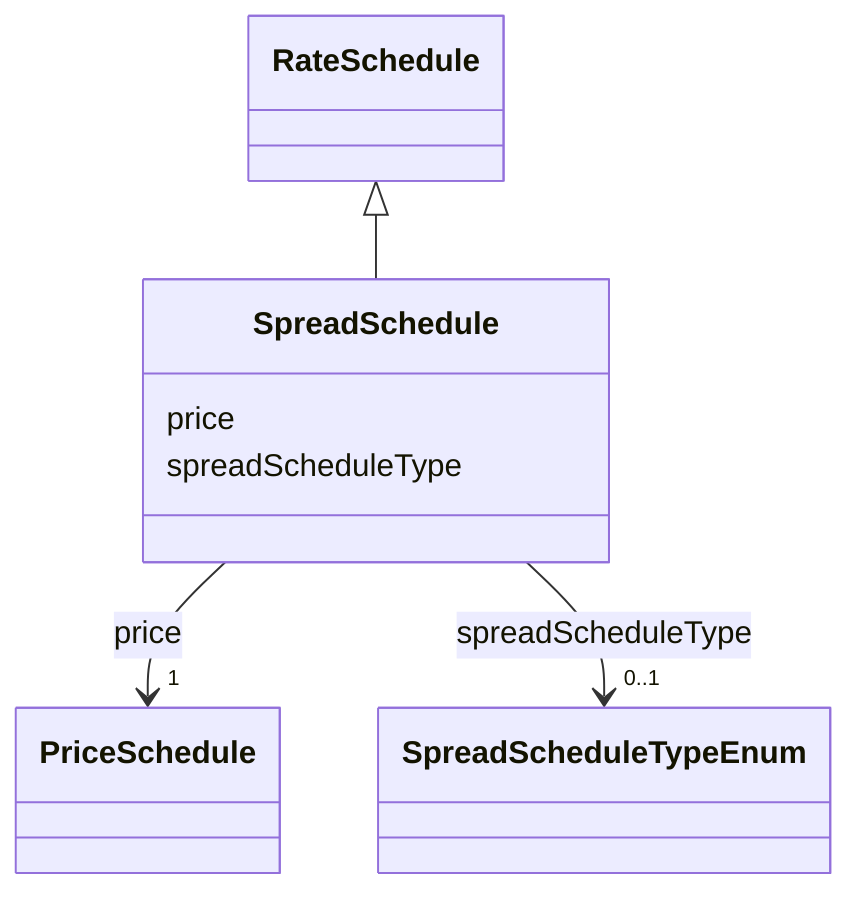

```mermaid
 classDiagram
    class SpreadSchedule
    click SpreadSchedule href "../SpreadSchedule"
      RateSchedule <|-- SpreadSchedule
        click RateSchedule href "../RateSchedule"
      
      SpreadSchedule : price
        
          
    
        
        
        SpreadSchedule --> "1" PriceSchedule : price
        click PriceSchedule href "../PriceSchedule"
    

        
      SpreadSchedule : spreadScheduleType
        
          
    
        
        
        SpreadSchedule --> "0..1" SpreadScheduleTypeEnum : spreadScheduleType
        click SpreadScheduleTypeEnum href "../SpreadScheduleTypeEnum"
    

        
      
```
