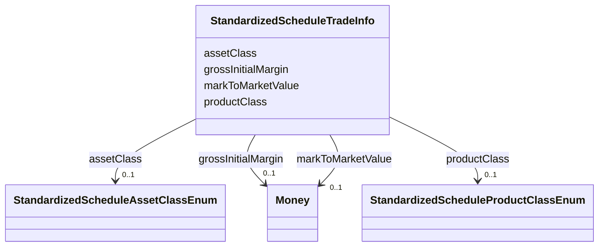

```mermaid
 classDiagram
    class StandardizedScheduleTradeInfo
    click StandardizedScheduleTradeInfo href "../StandardizedScheduleTradeInfo"
      StandardizedScheduleTradeInfo : assetClass
        
          
    
        
        
        StandardizedScheduleTradeInfo --> "0..1" StandardizedScheduleAssetClassEnum : assetClass
        click StandardizedScheduleAssetClassEnum href "../StandardizedScheduleAssetClassEnum"
    

        
      StandardizedScheduleTradeInfo : grossInitialMargin
        
          
    
        
        
        StandardizedScheduleTradeInfo --> "0..1" Money : grossInitialMargin
        click Money href "../Money"
    

        
      StandardizedScheduleTradeInfo : markToMarketValue
        
          
    
        
        
        StandardizedScheduleTradeInfo --> "0..1" Money : markToMarketValue
        click Money href "../Money"
    

        
      StandardizedScheduleTradeInfo : productClass
        
          
    
        
        
        StandardizedScheduleTradeInfo --> "0..1" StandardizedScheduleProductClassEnum : productClass
        click StandardizedScheduleProductClassEnum href "../StandardizedScheduleProductClassEnum"
    

        
      
```
