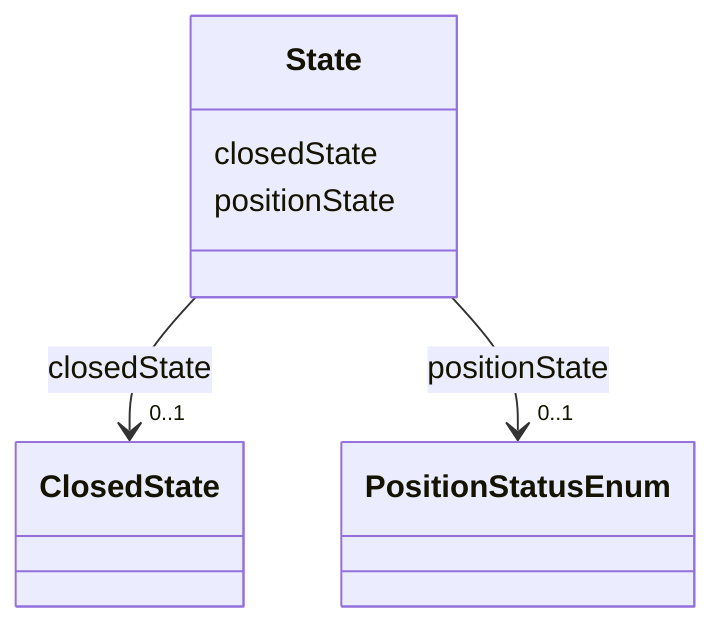

```mermaid
 classDiagram
    class State
    click State href "../State"
      State : closedState
        
          
    
        
        
        State --> "0..1" ClosedState : closedState
        click ClosedState href "../ClosedState"
    

        
      State : positionState
        
          
    
        
        
        State --> "0..1" PositionStatusEnum : positionState
        click PositionStatusEnum href "../PositionStatusEnum"
    

        
      
```
