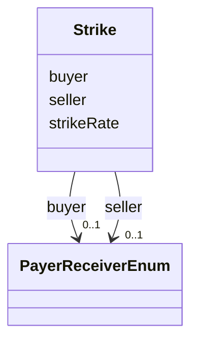

```mermaid
 classDiagram
    class Strike
    click Strike href "../Strike"
      Strike : buyer
        
          
    
        
        
        Strike --> "0..1" PayerReceiverEnum : buyer
        click PayerReceiverEnum href "../PayerReceiverEnum"
    

        
      Strike : seller
        
          
    
        
        
        Strike --> "0..1" PayerReceiverEnum : seller
        click PayerReceiverEnum href "../PayerReceiverEnum"
    

        
      Strike : strikeRate
        
      
```
