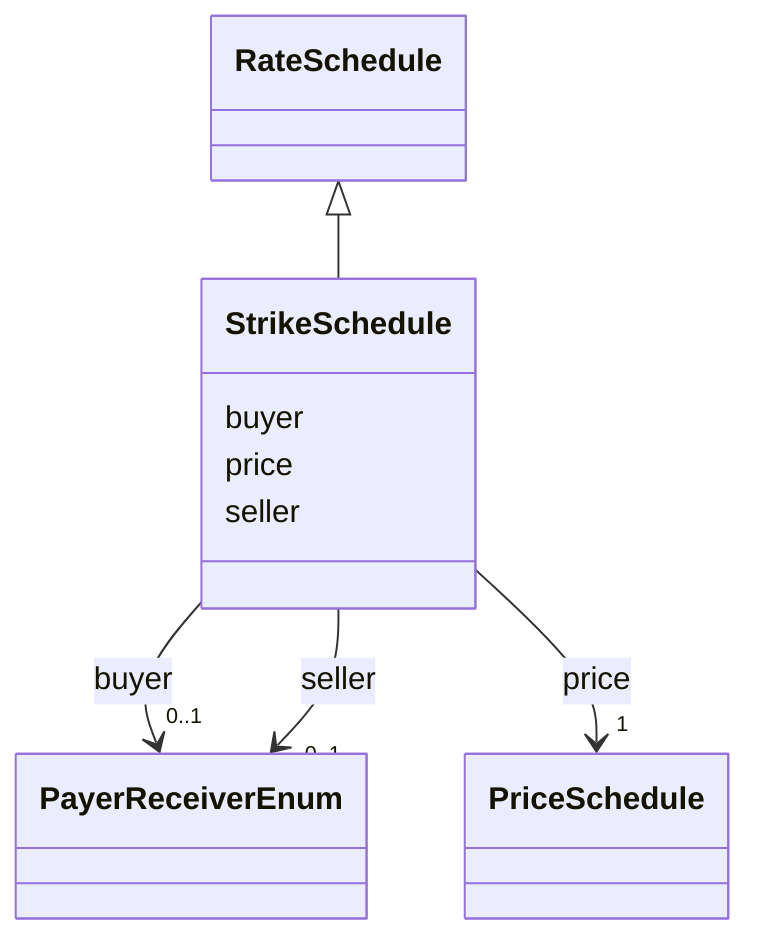

```mermaid
 classDiagram
    class StrikeSchedule
    click StrikeSchedule href "../StrikeSchedule"
      RateSchedule <|-- StrikeSchedule
        click RateSchedule href "../RateSchedule"
      
      StrikeSchedule : buyer
        
          
    
        
        
        StrikeSchedule --> "0..1" PayerReceiverEnum : buyer
        click PayerReceiverEnum href "../PayerReceiverEnum"
    

        
      StrikeSchedule : price
        
          
    
        
        
        StrikeSchedule --> "1" PriceSchedule : price
        click PriceSchedule href "../PriceSchedule"
    

        
      StrikeSchedule : seller
        
          
    
        
        
        StrikeSchedule --> "0..1" PayerReceiverEnum : seller
        click PayerReceiverEnum href "../PayerReceiverEnum"
    

        
      
```
