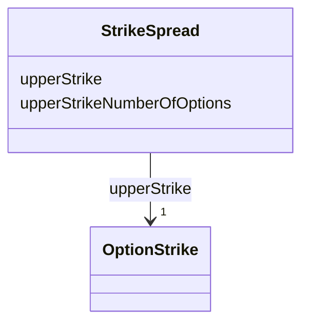

```mermaid
 classDiagram
    class StrikeSpread
    click StrikeSpread href "../StrikeSpread"
      StrikeSpread : upperStrike
        
          
    
        
        
        StrikeSpread --> "1" OptionStrike : upperStrike
        click OptionStrike href "../OptionStrike"
    

        
      StrikeSpread : upperStrikeNumberOfOptions
        
      
```
