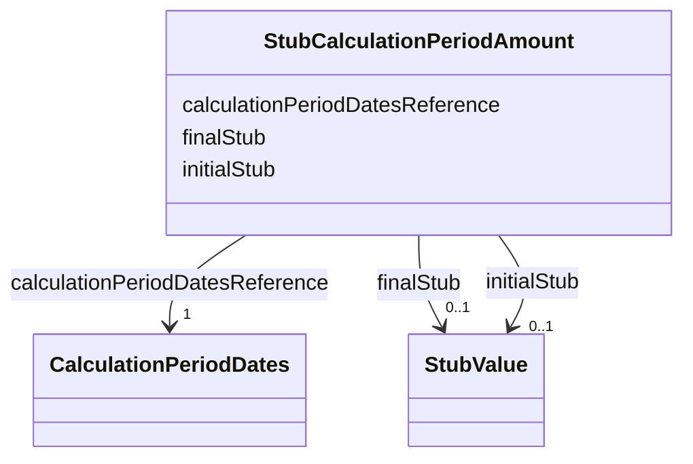

```mermaid
 classDiagram
    class StubCalculationPeriodAmount
    click StubCalculationPeriodAmount href "../StubCalculationPeriodAmount"
      StubCalculationPeriodAmount : calculationPeriodDatesReference
        
          
    
        
        
        StubCalculationPeriodAmount --> "1" CalculationPeriodDates : calculationPeriodDatesReference
        click CalculationPeriodDates href "../CalculationPeriodDates"
    

        
      StubCalculationPeriodAmount : finalStub
        
          
    
        
        
        StubCalculationPeriodAmount --> "0..1" StubValue : finalStub
        click StubValue href "../StubValue"
    

        
      StubCalculationPeriodAmount : initialStub
        
          
    
        
        
        StubCalculationPeriodAmount --> "0..1" StubValue : initialStub
        click StubValue href "../StubValue"
    

        
      
```
