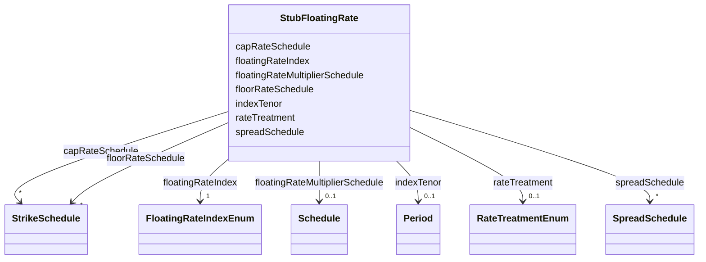

```mermaid
 classDiagram
    class StubFloatingRate
    click StubFloatingRate href "../StubFloatingRate"
      StubFloatingRate : capRateSchedule
        
          
    
        
        
        StubFloatingRate --> "*" StrikeSchedule : capRateSchedule
        click StrikeSchedule href "../StrikeSchedule"
    

        
      StubFloatingRate : floatingRateIndex
        
          
    
        
        
        StubFloatingRate --> "1" FloatingRateIndexEnum : floatingRateIndex
        click FloatingRateIndexEnum href "../FloatingRateIndexEnum"
    

        
      StubFloatingRate : floatingRateMultiplierSchedule
        
          
    
        
        
        StubFloatingRate --> "0..1" Schedule : floatingRateMultiplierSchedule
        click Schedule href "../Schedule"
    

        
      StubFloatingRate : floorRateSchedule
        
          
    
        
        
        StubFloatingRate --> "*" StrikeSchedule : floorRateSchedule
        click StrikeSchedule href "../StrikeSchedule"
    

        
      StubFloatingRate : indexTenor
        
          
    
        
        
        StubFloatingRate --> "0..1" Period : indexTenor
        click Period href "../Period"
    

        
      StubFloatingRate : rateTreatment
        
          
    
        
        
        StubFloatingRate --> "0..1" RateTreatmentEnum : rateTreatment
        click RateTreatmentEnum href "../RateTreatmentEnum"
    

        
      StubFloatingRate : spreadSchedule
        
          
    
        
        
        StubFloatingRate --> "*" SpreadSchedule : spreadSchedule
        click SpreadSchedule href "../SpreadSchedule"
    

        
      
```
