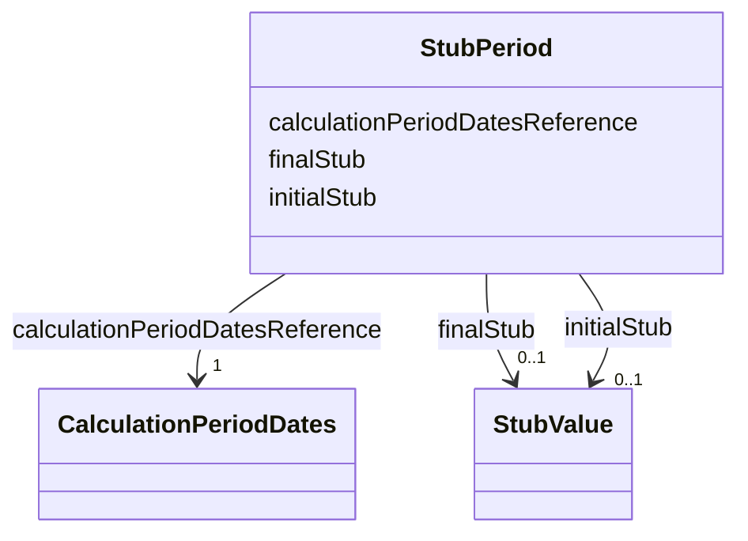

```mermaid
 classDiagram
    class StubPeriod
    click StubPeriod href "../StubPeriod"
      StubPeriod : calculationPeriodDatesReference
        
          
    
        
        
        StubPeriod --> "1" CalculationPeriodDates : calculationPeriodDatesReference
        click CalculationPeriodDates href "../CalculationPeriodDates"
    

        
      StubPeriod : finalStub
        
          
    
        
        
        StubPeriod --> "0..1" StubValue : finalStub
        click StubValue href "../StubValue"
    

        
      StubPeriod : initialStub
        
          
    
        
        
        StubPeriod --> "0..1" StubValue : initialStub
        click StubValue href "../StubValue"
    

        
      
```
