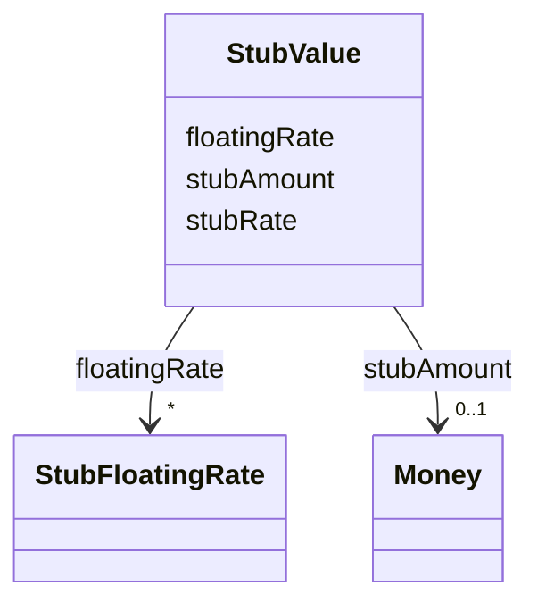

```mermaid
 classDiagram
    class StubValue
    click StubValue href "../StubValue"
      StubValue : floatingRate
        
          
    
        
        
        StubValue --> "*" StubFloatingRate : floatingRate
        click StubFloatingRate href "../StubFloatingRate"
    

        
      StubValue : stubAmount
        
          
    
        
        
        StubValue --> "0..1" Money : stubAmount
        click Money href "../Money"
    

        
      StubValue : stubRate
        
      
```
