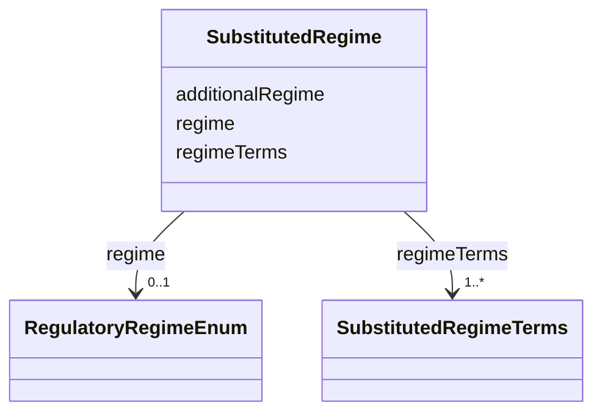

```mermaid
 classDiagram
    class SubstitutedRegime
    click SubstitutedRegime href "../SubstitutedRegime"
      SubstitutedRegime : additionalRegime
        
      SubstitutedRegime : regime
        
          
    
        
        
        SubstitutedRegime --> "0..1" RegulatoryRegimeEnum : regime
        click RegulatoryRegimeEnum href "../RegulatoryRegimeEnum"
    

        
      SubstitutedRegime : regimeTerms
        
          
    
        
        
        SubstitutedRegime --> "1..*" SubstitutedRegimeTerms : regimeTerms
        click SubstitutedRegimeTerms href "../SubstitutedRegimeTerms"
    

        
      
```
