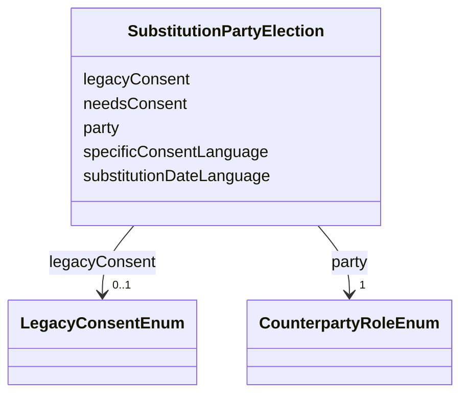

```mermaid
 classDiagram
    class SubstitutionPartyElection
    click SubstitutionPartyElection href "../SubstitutionPartyElection"
      SubstitutionPartyElection : legacyConsent
        
          
    
        
        
        SubstitutionPartyElection --> "0..1" LegacyConsentEnum : legacyConsent
        click LegacyConsentEnum href "../LegacyConsentEnum"
    

        
      SubstitutionPartyElection : needsConsent
        
      SubstitutionPartyElection : party
        
          
    
        
        
        SubstitutionPartyElection --> "1" CounterpartyRoleEnum : party
        click CounterpartyRoleEnum href "../CounterpartyRoleEnum"
    

        
      SubstitutionPartyElection : specificConsentLanguage
        
      SubstitutionPartyElection : substitutionDateLanguage
        
      
```
