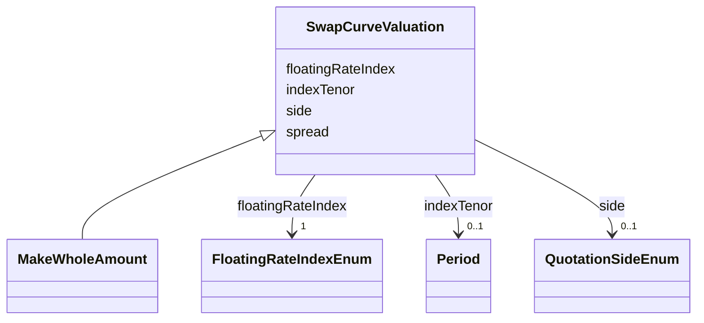

```mermaid
 classDiagram
    class SwapCurveValuation
    click SwapCurveValuation href "../SwapCurveValuation"
      SwapCurveValuation <|-- MakeWholeAmount
        click MakeWholeAmount href "../MakeWholeAmount"
      
      SwapCurveValuation : floatingRateIndex
        
          
    
        
        
        SwapCurveValuation --> "1" FloatingRateIndexEnum : floatingRateIndex
        click FloatingRateIndexEnum href "../FloatingRateIndexEnum"
    

        
      SwapCurveValuation : indexTenor
        
          
    
        
        
        SwapCurveValuation --> "0..1" Period : indexTenor
        click Period href "../Period"
    

        
      SwapCurveValuation : side
        
          
    
        
        
        SwapCurveValuation --> "0..1" QuotationSideEnum : side
        click QuotationSideEnum href "../QuotationSideEnum"
    

        
      SwapCurveValuation : spread
        
      
```
