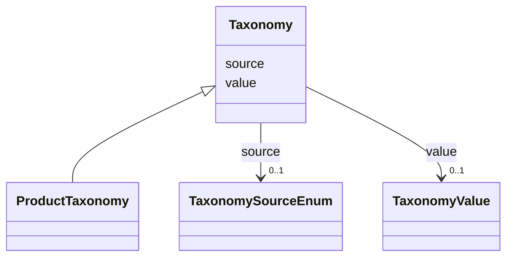

```mermaid
 classDiagram
    class Taxonomy
    click Taxonomy href "../Taxonomy"
      Taxonomy <|-- ProductTaxonomy
        click ProductTaxonomy href "../ProductTaxonomy"
      
      Taxonomy : source
        
          
    
        
        
        Taxonomy --> "0..1" TaxonomySourceEnum : source
        click TaxonomySourceEnum href "../TaxonomySourceEnum"
    

        
      Taxonomy : value
        
          
    
        
        
        Taxonomy --> "0..1" TaxonomyValue : value
        click TaxonomyValue href "../TaxonomyValue"
    

        
      
```
