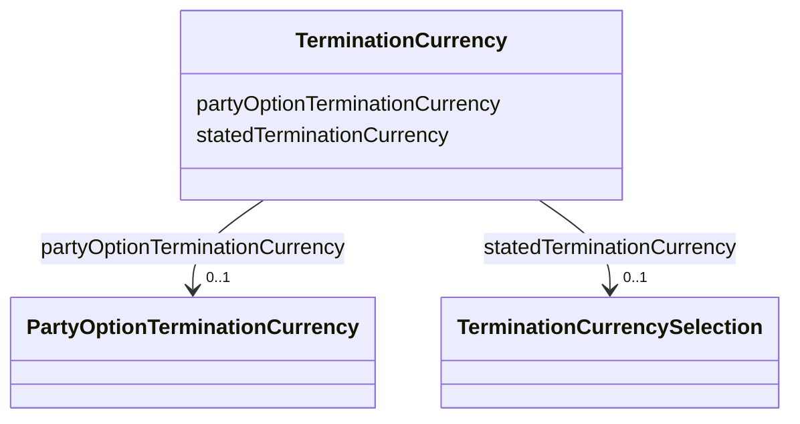

```mermaid
 classDiagram
    class TerminationCurrency
    click TerminationCurrency href "../TerminationCurrency"
      TerminationCurrency : partyOptionTerminationCurrency
        
          
    
        
        
        TerminationCurrency --> "0..1" PartyOptionTerminationCurrency : partyOptionTerminationCurrency
        click PartyOptionTerminationCurrency href "../PartyOptionTerminationCurrency"
    

        
      TerminationCurrency : statedTerminationCurrency
        
          
    
        
        
        TerminationCurrency --> "0..1" TerminationCurrencySelection : statedTerminationCurrency
        click TerminationCurrencySelection href "../TerminationCurrencySelection"
    

        
      
```
