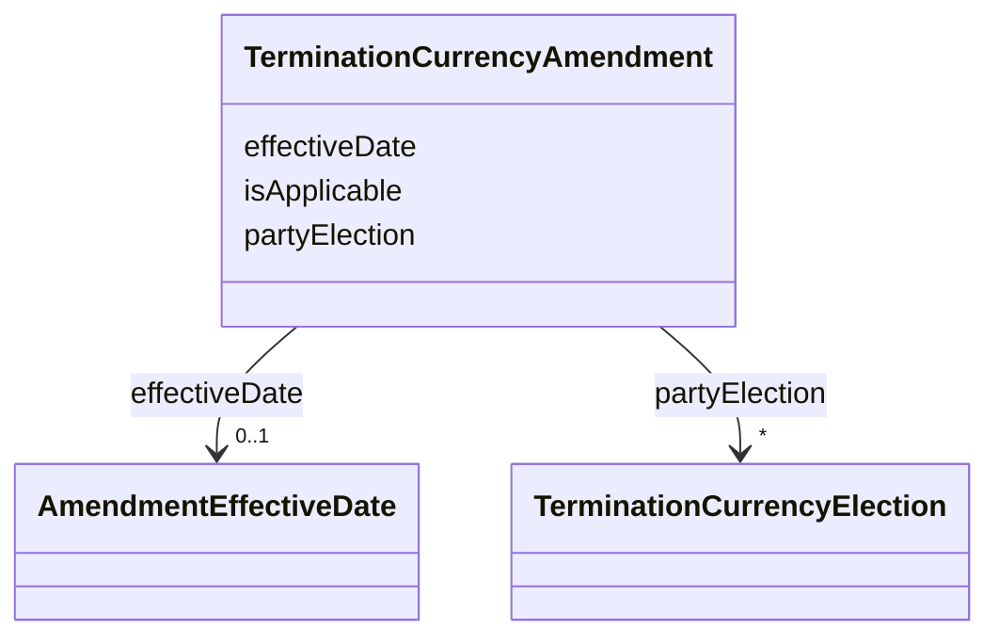

```mermaid
 classDiagram
    class TerminationCurrencyAmendment
    click TerminationCurrencyAmendment href "../TerminationCurrencyAmendment"
      TerminationCurrencyAmendment : effectiveDate
        
          
    
        
        
        TerminationCurrencyAmendment --> "0..1" AmendmentEffectiveDate : effectiveDate
        click AmendmentEffectiveDate href "../AmendmentEffectiveDate"
    

        
      TerminationCurrencyAmendment : isApplicable
        
      TerminationCurrencyAmendment : partyElection
        
          
    
        
        
        TerminationCurrencyAmendment --> "*" TerminationCurrencyElection : partyElection
        click TerminationCurrencyElection href "../TerminationCurrencyElection"
    

        
      
```
