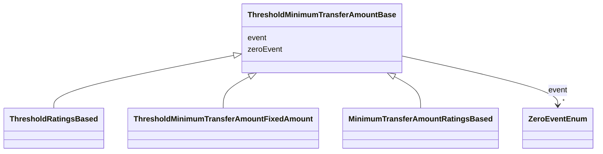

```mermaid
 classDiagram
    class ThresholdMinimumTransferAmountBase
    click ThresholdMinimumTransferAmountBase href "../ThresholdMinimumTransferAmountBase"
      ThresholdMinimumTransferAmountBase <|-- ThresholdRatingsBased
        click ThresholdRatingsBased href "../ThresholdRatingsBased"
      ThresholdMinimumTransferAmountBase <|-- ThresholdMinimumTransferAmountFixedAmount
        click ThresholdMinimumTransferAmountFixedAmount href "../ThresholdMinimumTransferAmountFixedAmount"
      ThresholdMinimumTransferAmountBase <|-- MinimumTransferAmountRatingsBased
        click MinimumTransferAmountRatingsBased href "../MinimumTransferAmountRatingsBased"
      
      ThresholdMinimumTransferAmountBase : event
        
          
    
        
        
        ThresholdMinimumTransferAmountBase --> "*" ZeroEventEnum : event
        click ZeroEventEnum href "../ZeroEventEnum"
    

        
      ThresholdMinimumTransferAmountBase : zeroEvent
        
      
```
