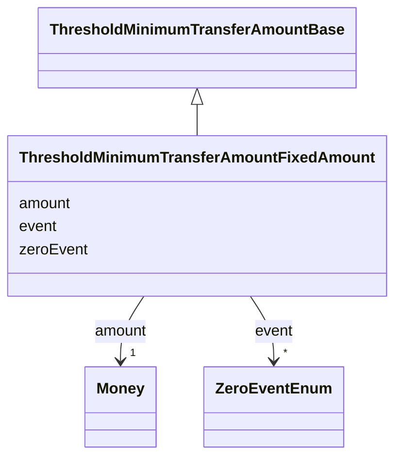

```mermaid
 classDiagram
    class ThresholdMinimumTransferAmountFixedAmount
    click ThresholdMinimumTransferAmountFixedAmount href "../ThresholdMinimumTransferAmountFixedAmount"
      ThresholdMinimumTransferAmountBase <|-- ThresholdMinimumTransferAmountFixedAmount
        click ThresholdMinimumTransferAmountBase href "../ThresholdMinimumTransferAmountBase"
      
      ThresholdMinimumTransferAmountFixedAmount : amount
        
          
    
        
        
        ThresholdMinimumTransferAmountFixedAmount --> "1" Money : amount
        click Money href "../Money"
    

        
      ThresholdMinimumTransferAmountFixedAmount : event
        
          
    
        
        
        ThresholdMinimumTransferAmountFixedAmount --> "*" ZeroEventEnum : event
        click ZeroEventEnum href "../ZeroEventEnum"
    

        
      ThresholdMinimumTransferAmountFixedAmount : zeroEvent
        
      
```
