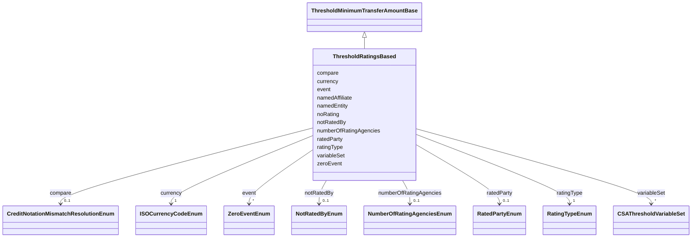

```mermaid
 classDiagram
    class ThresholdRatingsBased
    click ThresholdRatingsBased href "../ThresholdRatingsBased"
      ThresholdMinimumTransferAmountBase <|-- ThresholdRatingsBased
        click ThresholdMinimumTransferAmountBase href "../ThresholdMinimumTransferAmountBase"
      
      ThresholdRatingsBased : compare
        
          
    
        
        
        ThresholdRatingsBased --> "0..1" CreditNotationMismatchResolutionEnum : compare
        click CreditNotationMismatchResolutionEnum href "../CreditNotationMismatchResolutionEnum"
    

        
      ThresholdRatingsBased : currency
        
          
    
        
        
        ThresholdRatingsBased --> "1" ISOCurrencyCodeEnum : currency
        click ISOCurrencyCodeEnum href "../ISOCurrencyCodeEnum"
    

        
      ThresholdRatingsBased : event
        
          
    
        
        
        ThresholdRatingsBased --> "*" ZeroEventEnum : event
        click ZeroEventEnum href "../ZeroEventEnum"
    

        
      ThresholdRatingsBased : namedAffiliate
        
      ThresholdRatingsBased : namedEntity
        
      ThresholdRatingsBased : noRating
        
      ThresholdRatingsBased : notRatedBy
        
          
    
        
        
        ThresholdRatingsBased --> "0..1" NotRatedByEnum : notRatedBy
        click NotRatedByEnum href "../NotRatedByEnum"
    

        
      ThresholdRatingsBased : numberOfRatingAgencies
        
          
    
        
        
        ThresholdRatingsBased --> "0..1" NumberOfRatingAgenciesEnum : numberOfRatingAgencies
        click NumberOfRatingAgenciesEnum href "../NumberOfRatingAgenciesEnum"
    

        
      ThresholdRatingsBased : ratedParty
        
          
    
        
        
        ThresholdRatingsBased --> "0..1" RatedPartyEnum : ratedParty
        click RatedPartyEnum href "../RatedPartyEnum"
    

        
      ThresholdRatingsBased : ratingType
        
          
    
        
        
        ThresholdRatingsBased --> "1" RatingTypeEnum : ratingType
        click RatingTypeEnum href "../RatingTypeEnum"
    

        
      ThresholdRatingsBased : variableSet
        
          
    
        
        
        ThresholdRatingsBased --> "*" CSAThresholdVariableSet : variableSet
        click CSAThresholdVariableSet href "../CSAThresholdVariableSet"
    

        
      ThresholdRatingsBased : zeroEvent
        
      
```
