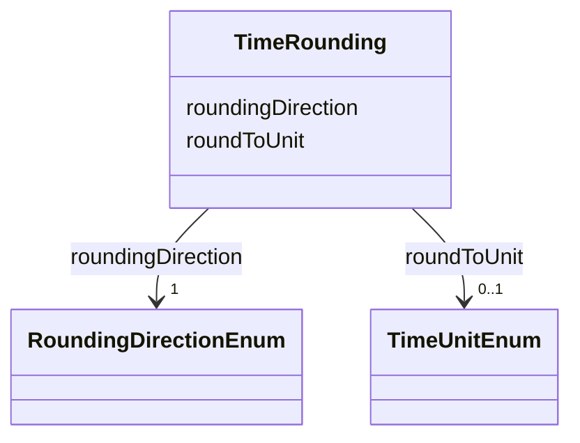

```mermaid
 classDiagram
    class TimeRounding
    click TimeRounding href "../TimeRounding"
      TimeRounding : roundingDirection
        
          
    
        
        
        TimeRounding --> "1" RoundingDirectionEnum : roundingDirection
        click RoundingDirectionEnum href "../RoundingDirectionEnum"
    

        
      TimeRounding : roundToUnit
        
          
    
        
        
        TimeRounding --> "0..1" TimeUnitEnum : roundToUnit
        click TimeUnitEnum href "../TimeUnitEnum"
    

        
      
```
