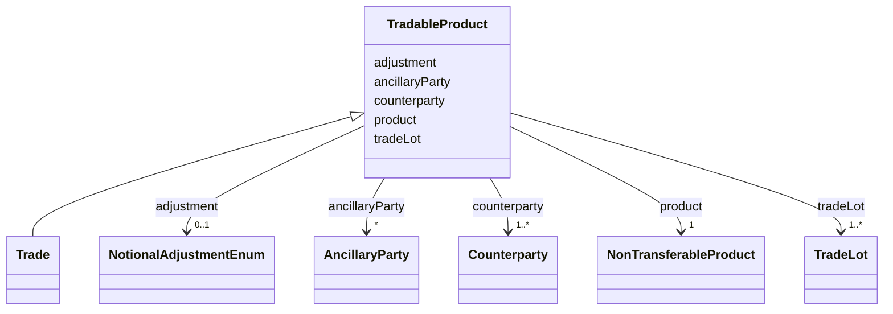

```mermaid
 classDiagram
    class TradableProduct
    click TradableProduct href "../TradableProduct"
      TradableProduct <|-- Trade
        click Trade href "../Trade"
      
      TradableProduct : adjustment
        
          
    
        
        
        TradableProduct --> "0..1" NotionalAdjustmentEnum : adjustment
        click NotionalAdjustmentEnum href "../NotionalAdjustmentEnum"
    

        
      TradableProduct : ancillaryParty
        
          
    
        
        
        TradableProduct --> "*" AncillaryParty : ancillaryParty
        click AncillaryParty href "../AncillaryParty"
    

        
      TradableProduct : counterparty
        
          
    
        
        
        TradableProduct --> "1..*" Counterparty : counterparty
        click Counterparty href "../Counterparty"
    

        
      TradableProduct : product
        
          
    
        
        
        TradableProduct --> "1" NonTransferableProduct : product
        click NonTransferableProduct href "../NonTransferableProduct"
    

        
      TradableProduct : tradeLot
        
          
    
        
        
        TradableProduct --> "1..*" TradeLot : tradeLot
        click TradeLot href "../TradeLot"
    

        
      
```
