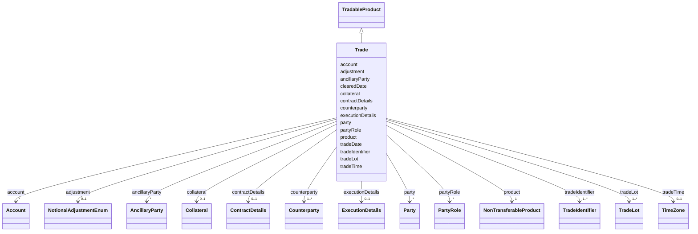

```mermaid
 classDiagram
    class Trade
    click Trade href "../Trade"
      TradableProduct <|-- Trade
        click TradableProduct href "../TradableProduct"
      
      Trade : account
        
          
    
        
        
        Trade --> "*" Account : account
        click Account href "../Account"
    

        
      Trade : adjustment
        
          
    
        
        
        Trade --> "0..1" NotionalAdjustmentEnum : adjustment
        click NotionalAdjustmentEnum href "../NotionalAdjustmentEnum"
    

        
      Trade : ancillaryParty
        
          
    
        
        
        Trade --> "*" AncillaryParty : ancillaryParty
        click AncillaryParty href "../AncillaryParty"
    

        
      Trade : clearedDate
        
      Trade : collateral
        
          
    
        
        
        Trade --> "0..1" Collateral : collateral
        click Collateral href "../Collateral"
    

        
      Trade : contractDetails
        
          
    
        
        
        Trade --> "0..1" ContractDetails : contractDetails
        click ContractDetails href "../ContractDetails"
    

        
      Trade : counterparty
        
          
    
        
        
        Trade --> "1..*" Counterparty : counterparty
        click Counterparty href "../Counterparty"
    

        
      Trade : executionDetails
        
          
    
        
        
        Trade --> "0..1" ExecutionDetails : executionDetails
        click ExecutionDetails href "../ExecutionDetails"
    

        
      Trade : party
        
          
    
        
        
        Trade --> "*" Party : party
        click Party href "../Party"
    

        
      Trade : partyRole
        
          
    
        
        
        Trade --> "*" PartyRole : partyRole
        click PartyRole href "../PartyRole"
    

        
      Trade : product
        
          
    
        
        
        Trade --> "1" NonTransferableProduct : product
        click NonTransferableProduct href "../NonTransferableProduct"
    

        
      Trade : tradeDate
        
      Trade : tradeIdentifier
        
          
    
        
        
        Trade --> "1..*" TradeIdentifier : tradeIdentifier
        click TradeIdentifier href "../TradeIdentifier"
    

        
      Trade : tradeLot
        
          
    
        
        
        Trade --> "1..*" TradeLot : tradeLot
        click TradeLot href "../TradeLot"
    

        
      Trade : tradeTime
        
          
    
        
        
        Trade --> "0..1" TimeZone : tradeTime
        click TimeZone href "../TimeZone"
    

        
      
```
